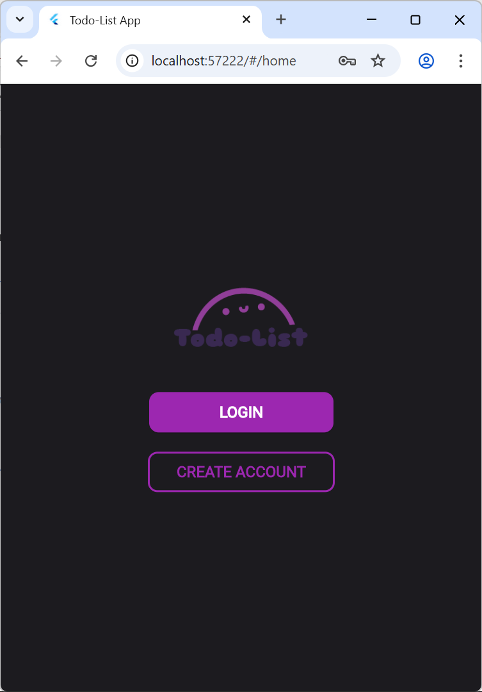
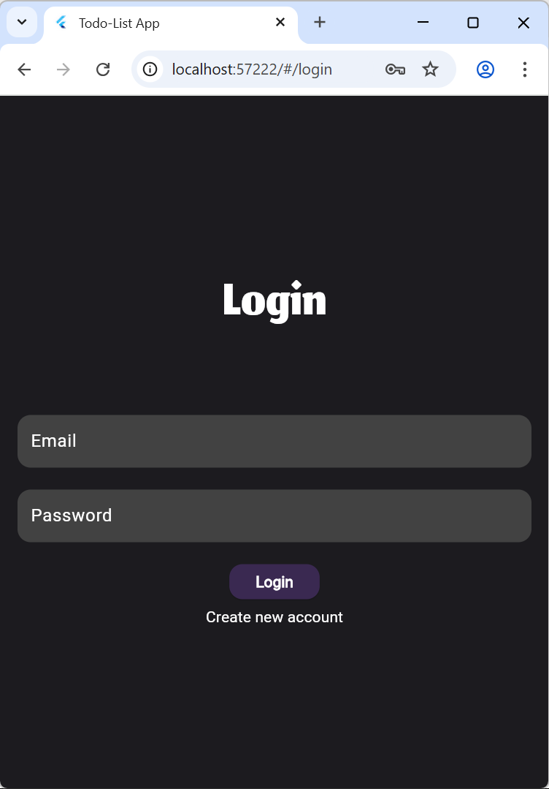
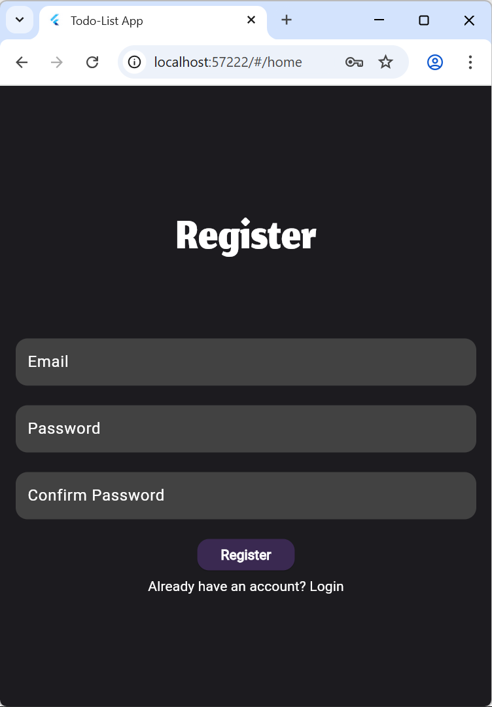
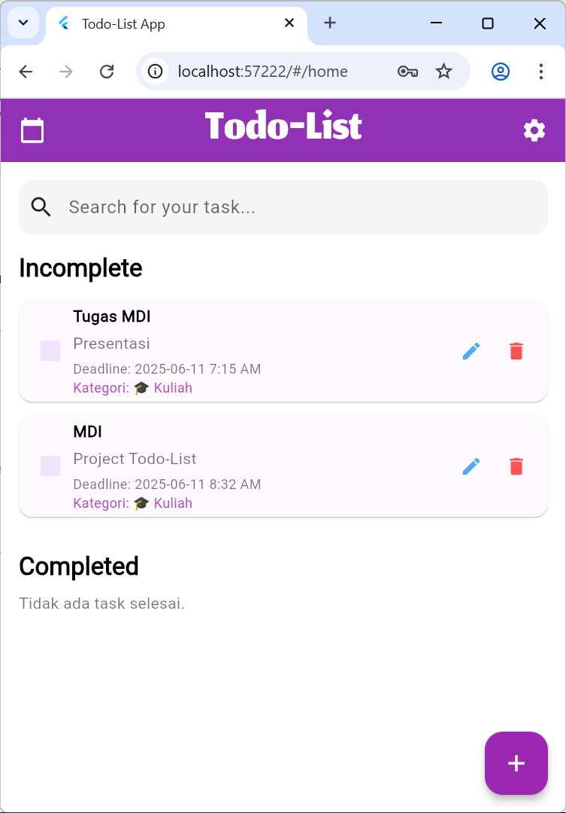
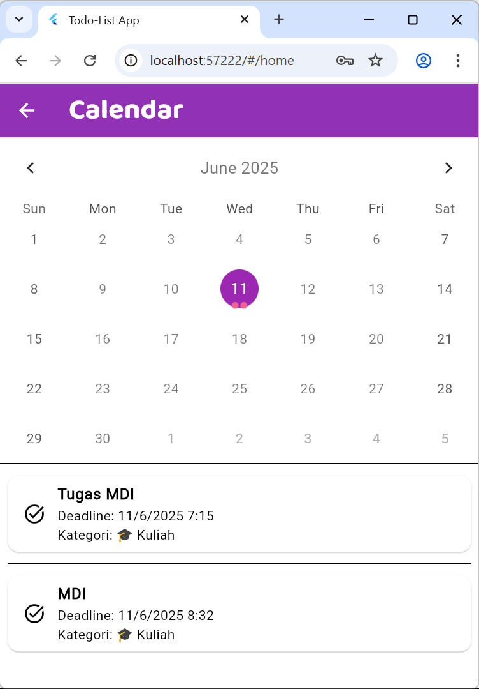
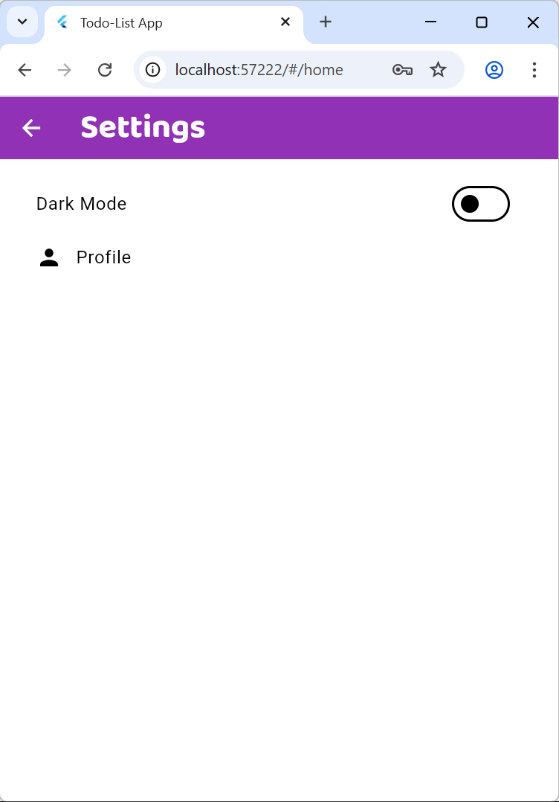
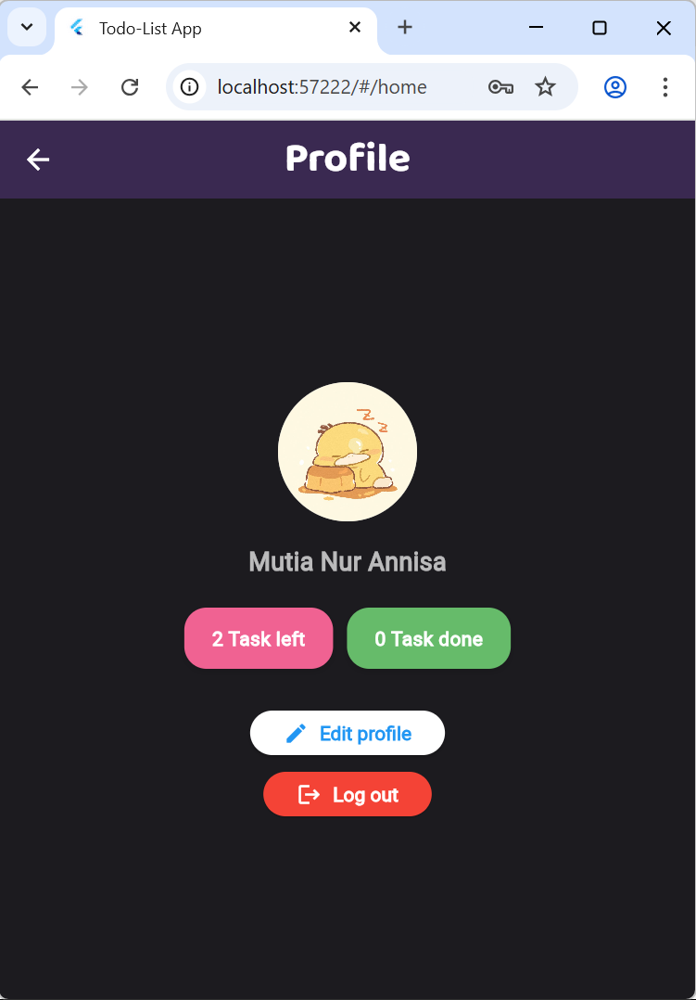
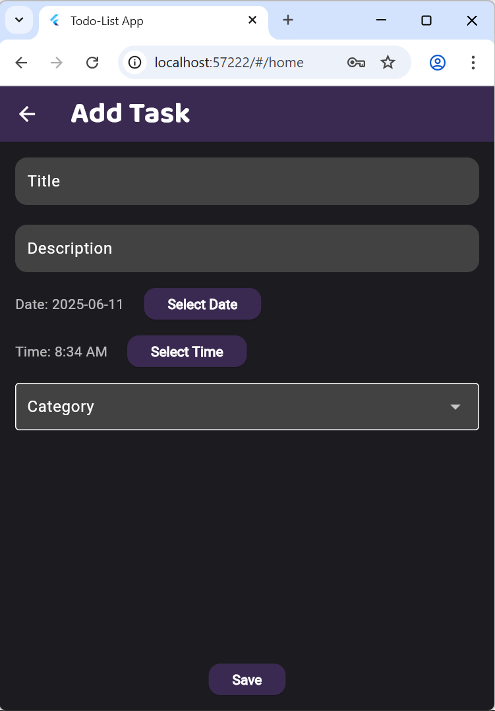
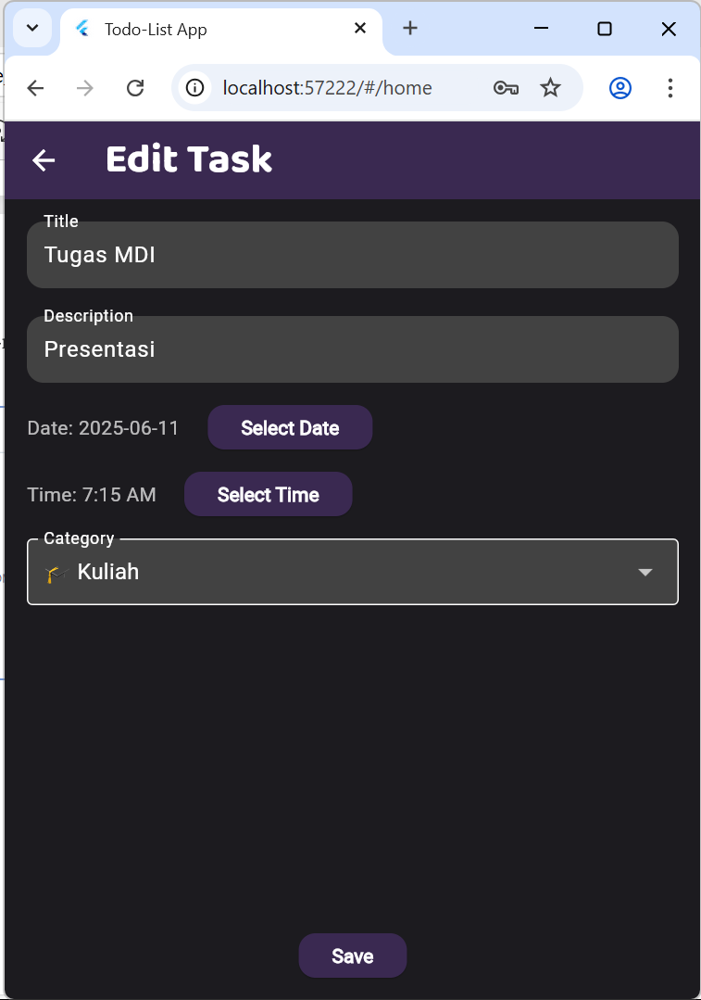

# todolist

- Nama : Mutia Nur Annisa
- Judul Project : Todo-List
- Deskripsi Fungsionalitas Aplikasi
Todo-List App adalah aplikasi manajemen tugas pribadi yang intuitif dan efisien, dirancang untuk membantu pengguna mengatur, melacak, dan mengelola tugas-tugas harian serta jadwal pribadi mereka. Aplikasi ini mengintegrasikan fitur-fitur penting untuk meningkatkan produktivitas dan memastikan pengguna tetap terorganisir.Fungsionalitas Utama:
  1. Autentikasi Pengguna : Pengguna dapat mendaftar akun baru (`CREATE ACCOUNT`) atau masuk (`LOGIN`) menggunakan kredensial email dan kata sandi. Ini memungkinkan personalisasi data dan penyimpanan tugas yang aman.
  2. Manajemen Tugas Komprehensif
    - Daftar Tugas: Menampilkan daftar tugas yang terorganisir, dibagi menjadi dua kategori utama: "Incomplete" (tugas yang belum selesai) dan "Completed" (tugas yang sudah diselesaikan).
    - Tambah Tugas: Pengguna dapat dengan mudah menambahkan tugas baru melalui *form* yang detail, mencakup *Title*, *Description*, *Date* (tanggal jatuh tempo), *Time* (waktu jatuh tempo), dan *Category* (kategori tugas).
    - Edit Tugas: Tugas yang sudah ada dapat diedit kapan saja untuk memperbarui detail seperti judul, deskripsi, tanggal, waktu, atau kategori.
    - Hapus Tugas: Opsi untuk menghapus tugas yang tidak lagi relevan atau diperlukan.
    - Tandai Selesai: Tugas dapat ditandai sebagai selesai hanya dengan mencentang kotak di samping *item* tugas, otomatis berpindah ke daftar "Completed".
    - Pencarian Tugas: Tersedia *search bar* di halaman utama untuk memudahkan pencarian tugas berdasarkan kata kunci tertentu.
  3. Manajemen Jadwal dan Kalender:
    - Tampilan Kalender: Menampilkan kalender bulanan yang jelas, memungkinkan pengguna menavigasi antar tanggal dan bulan. Tanggal dengan tugas atau acara akan disorot.
    - Integrasi Google Calendar: Aplikasi ini terhubung dengan Google Calendar, memungkinkan pengguna untuk melihat dan mengelola tugas-tugas mereka bersamaan dengan acara-acara lain yang ada di Google Calendar mereka.
    - Daftar Tugas per Tanggal: Menampilkan daftar tugas yang terikat dengan tanggal yang dipilih di kalender, memberikan gambaran jadwal harian yang terorganisir.
  4. Profil Pengguna:
    - Pengguna dapat melihat detail profil mereka, termasuk nama dan statistik ringkasan tugas (jumlah tugas yang tersisa dan yang sudah selesai).
    - Opsi untuk mengedit informasi profil dan *log out* dari akun.
  5. Pengaturan Aplikasi:
    - Dark Mode: Fitur *toggle* untuk beralih antara tema terang dan tema gelap, menyesuaikan tampilan aplikasi sesuai preferensi visual pengguna.
    - Akses cepat ke halaman Profil dari pengaturan.

- Teknologi yang Digunakan
    1. Flutter: Framework UI sumber terbuka dari Google yang digunakan untuk membangun antarmuka pengguna (UI) dan logika aplikasi inti. Flutter memungkinkan pengembangan aplikasi native yang indah dan cepat untuk berbagai platform (Android, iOS, Web, Desktop) dari satu codebase.
    2. Dart: Bahasa pemrograman yang digunakan oleh Flutter untuk mengembangkan aplikasi.
    3. Provider: Solusi manajemen status yang direkomendasikan Flutter untuk mengelola dan menyediakan data aplikasi (seperti data tugas, status autentikasi, tema) secara efisien ke seluruh bagian aplikasi.
    4. Google Firebase: Digunakan sebagai backend lengkap untuk aplikasi, menyediakan layanan cloud yang scalable dan realtime.
    5. Cloud Firestore Database: Database *NoSQL* berbasis *cloud* yang digunakan untuk menyimpan dan menyinkronkan data tugas (seperti koleksi `tasks` dan `todos`) dan data terkait aplikasi lainnya secara *realtime*.
    6. Firebase Authentication: Layanan autentikasi *cloud* yang menyediakan cara aman dan mudah untuk mengelola pengguna, termasuk pendaftaran, masuk, dan pengelolaan kredensial email/kata sandi pengguna.
    7. Desain & Tema:
        - Material Design: Antarmuka pengguna mengadopsi pedoman desain Material Design Google, memastikan tampilan yang bersih, modern, dan konsisten di berbagai perangkat dan platform.
        - Custom Theme/Dark Mode: Implementasi tema yang fleksibel (`theme/app_theme.dart`, `theme/theme_provider.dart`) memungkinkan pengguna untuk beralih antara mode terang dan gelap, meningkatkan pengalaman pengguna.
    8. Google Calendar API (atau SDK terkait): Digunakan untuk mengintegrasikan fitur kalender aplikasi dengan Google Calendar, memungkinkan sinkronisasi dan tampilan acara/tugas dari Google Calendar di dalam aplikasi.

- Cara Menjalankan Aplikasi
1.  Mulai Pengalaman Pengguna (Start Screen):
    * Setelah aplikasi terbuka, Anda akan melihat "Start Screen" dengan logo "Todo-List".
    * Pilih opsi:
        * **"LOGIN"**: Jika Anda sudah memiliki akun.
        * **"CREATE ACCOUNT"**: Jika Anda adalah pengguna baru dan ingin mendaftar.

2.  Mengelola Tugas (Home Screen):
    * Melihat Tugas: "Home Screen" akan menampilkan daftar tugas Anda yang terbagi menjadi "Incomplete" (belum selesai) dan "Completed" (sudah selesai).
    * Menambah Tugas Baru:
        - Ketuk **Floating Action Button (FAB)** ikon `+` di pojok kanan bawah.
        - Di `Task Screen`, isi detail tugas seperti *Title*, *Description*, *Date*, *Time*, dan *Category*.
        - Ketuk `Save` untuk menyimpan tugas.
    * Menyelesaikan Tugas: Centang kotak di samping tugas di daftar "Incomplete" untuk menandainya selesai.
    * Mengedit Tugas (EditTask): Ketuk ikon pensil di samping tugas untuk membuka "Edit Task Screen" dan mengubah detailnya.
    * Menghapus Tugas: Ketuk ikon tempat sampah di samping tugas untuk menghapusnya.
    * Mencari Tugas: Gunakan *search bar* di bagian atas layar untuk mencari tugas dengan cepat.

3.  Melihat Jadwal (Calendar Screen):
    * Ketuk ikon kalender di *App Bar* (pojok kiri atas "Home Screen").
    * Di "Calendar Screen", Anda dapat melihat kalender bulanan Anda. Tanggal dengan tugas akan disorot.
    * Ketuk tanggal tertentu untuk melihat daftar tugas atau acara yang jatuh tempo pada hari itu.

4.  Mengatur Aplikasi (Settings & Profile Screen):
    * Ketuk ikon pengaturan (gear) di *App Bar* (pojok kanan atas "Home Screen").
    * Di "Settings Screen":
        * Gunakan *toggle switch* di samping "Dark Mode" untuk beralih antara tema terang dan gelap.
        * Ketuk **"Profile"** untuk mengakses "Profile Screen".
    * Di "Profile Screen", Anda dapat melihat detail profil Anda, statistik tugas, serta opsi untuk "Edit profile" atau "Log out".

- Screenshot UI dan Tampilan

